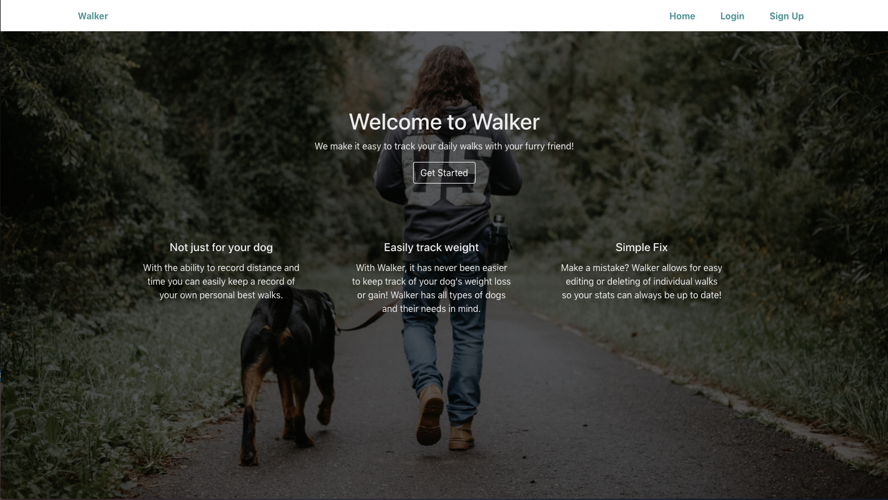
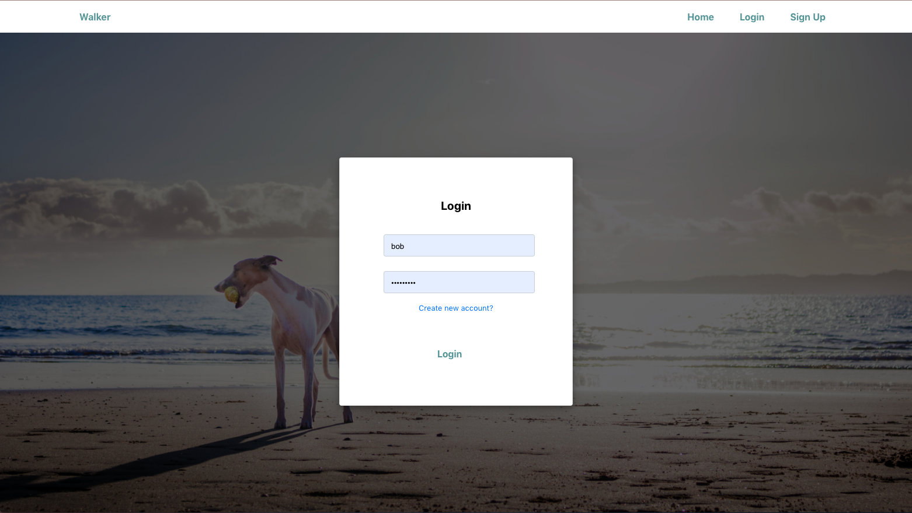
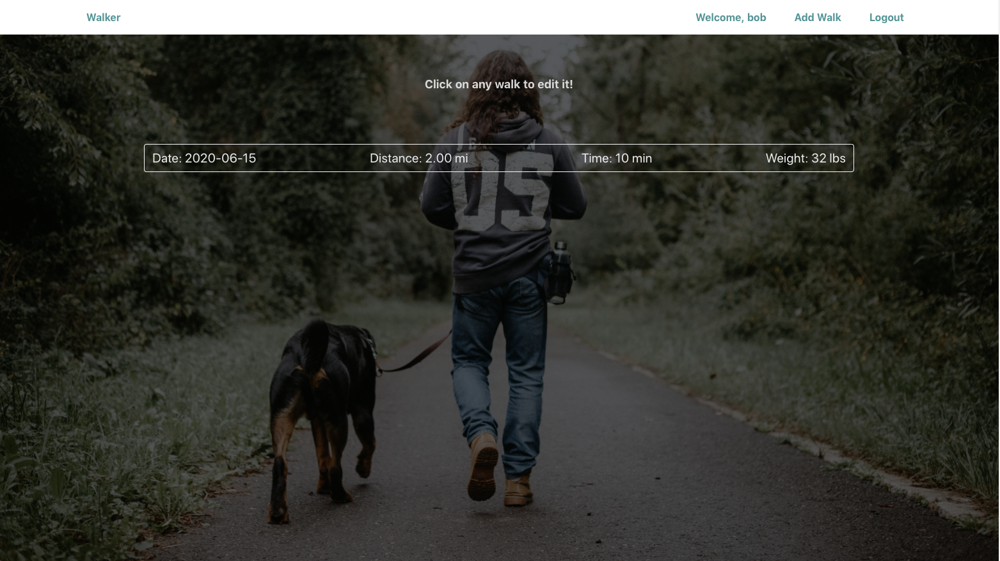
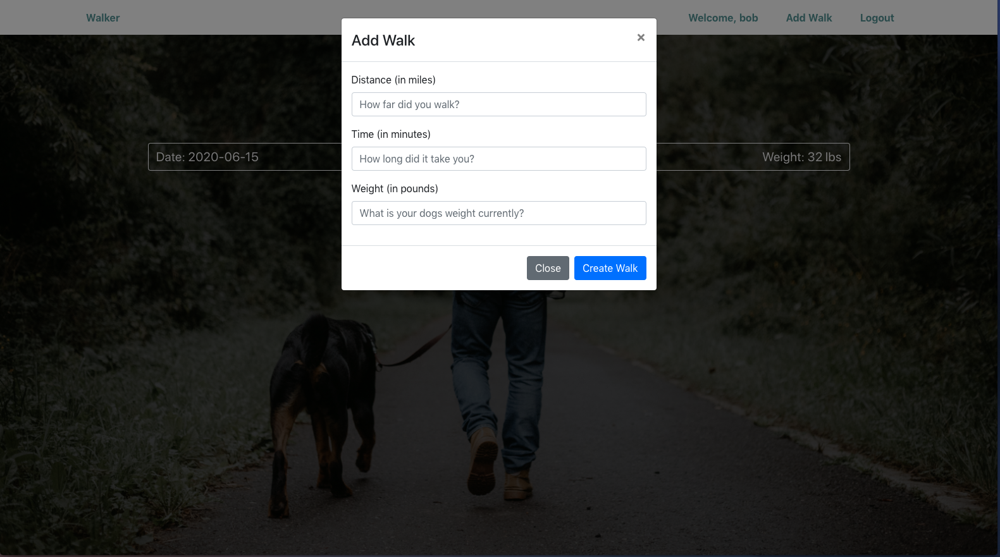

## Project 4 - Walker

### Description 

Walker is an app aimed at making dog walking easy to track. As a fellow dog owner and walker I always wanted an application that made it easy to track the distance, time, and weight of my dog. Walker allows for all that with an easy to use interface. Users can create individual walk entries and record their distance walked, time it took, and their dog's weight at the end of the walk.








### Technologies 

The technologies for the front-end of this project include:

- ReactJS
- ReactRouter
- ReactBootstrap
- Styled Components


The technologies for the backend-include:

- Django
- Django REST Framework
- JWT Auth

Both ends of the application were deployed using Heroku.

### Getting Started

To get started, navigate over to https://walker-323.herokuapp.com/ and create an account to begin creating your own personal walk entries!

### Installation Instructions 
Frontend:

- Fork and clone this repo to your CLI
- Run ```npm i``` to install the needed dependencies
- Once complete, feel free to open up the folder in your code editor and run ```npm start``` to set up a test server

Backend:

- Run ```pipenv install``` in the virtual environment of the project directory CLI to download required dependencies
- Run ```python3 manage.py runserver``` to start up a local version of the backend on port 8000.

#### Future Features

- Implementing charts to visually display your data for your walks that week
- Allowing users to input their walk route with google maps
- Allowing users to pin or favorite walk entries
